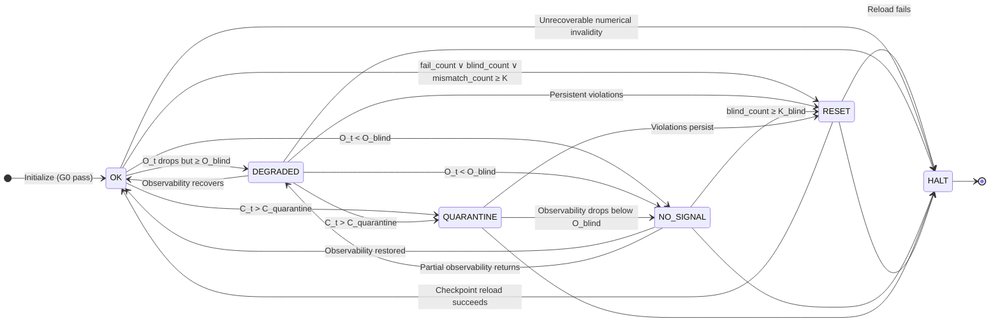

CEG Kernel v1.0 — State Machine (Informative)

Status: Informative visualization  
Normative authority: spec/CEG-KERNEL-v1.0.md

This document illustrates runtime state transitions defined normatively in the canonical kernel specification. It does not override or modify kernel semantics. If any discrepancy exists, the canonical specification governs.

---

## State Diagram

---

## State Semantics Summary

OK — emission allowed; assimilation allowed  
DEGRADED — emission allowed (flagged); assimilation allowed  
NO_SIGNAL — emission suppressed; predict-only  
QUARANTINE — emission suppressed; assimilation forbidden  
RESET — emission suppressed; reset transition step  
HALT — emission suppressed; terminal state

---

## Interpretation Notice

This diagram is provided solely as an implementation and audit aid.  
It is non-normative and illustrative.

The sole normative authority for kernel behavior is:

spec/CEG-KERNEL-v1.0.md

END